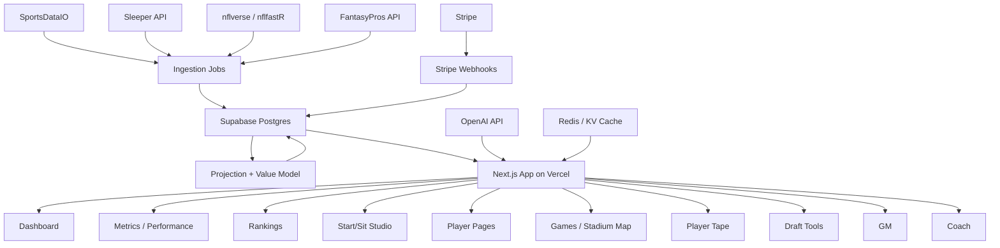

# 949Fantasy V1 Stack

> **Canonical source:** `/Users/matthewhanratty/Documents/New project/949fantasy-v1-stack.md`


## Purpose

This document is the implementation-facing stack brief for Cursor.

Cursor should use this alongside `949fantasy-working-brief.md`. The working brief explains the product thesis and screens. This file explains the recommended v1 technical stack and architecture.

## Product Goal

Build 949Fantasy as a premium fantasy football intelligence platform with:

- Dashboard / snapshot.
- Metrics and performance views.
- Weekly rankings.
- Rest-of-season rankings.
- Player pages.
- Start/sit studio.
- Games and stadium context.
- Player tape / trend exploration.
- Draft value tools.
- GM draft market recommendations.
- Coach lineup and waiver recommendations.
- Floor, median, and ceiling projections.
- Proprietary player value score.
- Boom/bust and risk labels.
- News, injury, weather, and matchup context.
- `$9.49` season pass gating.

## Recommended V1 Stack

| Layer | Tool | Purpose |
|---|---|---|
| Frontend | Next.js App Router | Main web application. |
| Hosting | Vercel Pro | Production hosting, preview deployments, serverless routes, cron jobs. |
| Database | Supabase Postgres | Source of truth for player data, rankings, projections, users, leagues, and subscriptions. |
| Auth | Supabase Auth | User login, sessions, and account management. |
| Storage | Supabase Storage or Vercel Blob | Raw data snapshots, model artifacts, exports, and media. |
| Payments | Stripe | Season pass checkout, webhooks, entitlement records. |
| Primary NFL Data | SportsDataIO NFL API | Fantasy stats, projections, injuries, depth charts, news, weather, ADP, fantasy points, and player data. |
| League Import | Sleeper API | First connected-league integration for users, leagues, rosters, drafts, and player IDs. |
| Historical Modeling | nflverse / nflfastR | Backtesting, historical weekly stats, floor/ceiling validation, projection error analysis. |
| Consensus/ADP | FantasyPros API, if commercially licensed | Market comparison, consensus ranks, ADP, and projection benchmarking. |
| AI Notes | OpenAI API | Player summaries, 949 Take, matchup notes, and news summaries. Not core projections. |
| Cache / Queue | Upstash Redis or Vercel KV | API response caching, rate protection, draft state, and short-lived computed outputs. |
| Email | Resend | Welcome, payment confirmation, weekly ranking drops, and alerts later. |
| Monitoring | Sentry | Production error tracking. |
| Product Analytics | PostHog or Vercel Analytics | Usage, conversion, retention, rankings interactions, and start/sit actions. |

## Prototype Data Provider Path

For early testing, it is acceptable to use the RapidAPI `Creativesdev / NFL API Data` provider as a temporary data source while building the 949Fantasy model and interface.

The broader provider priority is:

- V0 Test: free NFL data, GM agent, Coach agent, and drafting guide.
- V1 Core: SportsDataIO, Yahoo Fantasy API, Sleeper API, and platform ranking data.
- V2 Expansion: ESPN integration through an adapter after the core system is stable.

Use it only through a provider adapter. Do not call RapidAPI directly from React components or scatter provider-specific fields across the app.

Recommended pattern:

```txt
RapidAPI NFL API Data -> Provider Adapter -> Normalized Tables -> 949 Model -> App UI
SportsDataIO later     -> Provider Adapter -> Normalized Tables -> 949 Model -> App UI
```

This lets the product test metrics now and migrate to SportsDataIO at launch without rewriting the app.

### RapidAPI Use Cases

RapidAPI is acceptable for:

- Testing player/team ingestion.
- Testing schedule and game ingestion.
- Testing basic player stats.
- Testing standings and game metadata.
- Testing injuries if endpoint quality is sufficient.
- Building normalized schema.
- Building rankings and player pages against real-shaped data.
- Building games-map and schedule-context views if venue metadata is adequate.
- Running early value/floor/ceiling experiments.
- Proving app flows before committing to a commercial provider.

RapidAPI should not be treated as the final source of truth until these are verified:

- Commercial usage rights.
- Endpoint availability for all required data.
- Historical coverage.
- Update frequency.
- Player/team ID stability.
- Accuracy against trusted sources.
- Rate limits.
- Provider support and reliability.

### Migration Requirement

Cursor should build a provider abstraction from the start:

- `DataProvider`
- `RapidApiNflProvider`
- `SportsDataIoProvider`
- normalization functions that map provider payloads into internal database records

The app should query only Supabase/internal API routes, never third-party providers directly.

Internal database IDs should be controlled by 949Fantasy. Store external IDs in mapping fields/tables such as:

- `sportsdataio_player_id`
- `rapidapi_player_id`
- `sleeper_player_id`
- `fantasypros_player_id`

This preserves migration flexibility.

## Architecture



## V1 Product Scope

Build these first:

- Public home / season pass page.
- Authenticated dashboard.
- Metrics and performance pages.
- Rankings page.
- Player detail page.
- Start/sit studio.
- Games / stadium map page.
- Sleeper league import.
- Premium entitlement gating.
- Admin/model validation view.

Defer these until after v1:

- Yahoo import.
- ESPN import or unofficial ESPN integration.
- MyFantasyLeague import.
- DraftKings league import unless a reliable path is confirmed.
- Native mobile app.
- Fully live draft room.
- Custom scoring for every league setting.
- Social/community features.

## Data Provider Responsibilities

### SportsDataIO

Use as the primary production football data provider.

Needed data:

- Players.
- Teams.
- Stadiums and venue metadata.
- Schedules.
- Games.
- Game status and kickoff times.
- Player game stats.
- Player season stats.
- Historical weekly game logs.
- Fantasy points.
- Weekly projections.
- Season projections.
- Injuries.
- Depth charts.
- News.
- Weather.
- Home/away context.
- ADP.
- Opponent matchup context.
- Consensus game odds, if used for matchup environment.
- Player images if available.

### Sleeper

Use for the first connected fantasy platform.

Needed data:

- User lookup.
- User leagues.
- League settings.
- Rosters.
- Matchups.
- Starting lineups by week.
- Transactions, if available.
- Drafts.
- Draft picks.
- Sleeper player IDs.

### nflverse / nflfastR

Use for model research and validation.

Needed data:

- Historical play-by-play.
- Weekly player stats.
- Weekly player game logs by opponent and venue.
- Rosters.
- Schedules.
- Historical scoring outputs.
- Historical team defensive allowance by position.
- Backtesting datasets.

### FantasyPros

Use only if commercially licensed.

Needed data:

- Expert consensus rankings.
- ADP.
- Projections.
- Rest-of-season ranks.
- Weekly position ranks.

## Fantasy League Provider Matrix

Use this as the current planning baseline for league-sync work.

| Provider | API readiness | API connection lift | Current read |
|---|---:|---|---|
| Sleeper | 5 | Green | Best starting point. Public, documented, read-only API with strong league, roster, matchup, draft, and player coverage. |
| Yahoo | 4 | Yellow | Official API exists and is capable, but OAuth, app setup, and auth maintenance add real integration lift. |
| ESPN | 2 | Red | No stable official public fantasy API. Unofficial access exists, but it is brittle and risky for production. |
| CBS | 2 | Red | Public access and documentation are weak. Likely partner-gated, legacy, or unsupported for our needs. |
| NFL Fantasy | 1 | Red | Hardest path. Public integration appears effectively unavailable without partner-style access or fragile reverse engineering. |

Interpretation:

- `API readiness` is a 1-5 planning score where 5 is the cleanest implementation path.
- `API connection lift` is a quick implementation-risk signal:
  - Green = practical now.
  - Yellow = workable with real auth/setup effort.
  - Red = risky, brittle, or unclear for v1.

Recommended order of operations:

1. Start with Sleeper for the first real league import.
2. Add Yahoo as a V1 core integration if OAuth setup and data quality are confirmed.
3. Ingest platform ranking data, including ESPN top 300, independently from full league sync.
4. Treat ESPN full league integration as a V2 expansion track until a reliable production path is confirmed.
5. Treat CBS and NFL Fantasy as research tracks until we confirm reliable production access.

Important distinction:

- Platform rankings are draft-market inputs.
- League sync is roster/matchup state.

GM can use ESPN top 300 rankings as a platform-rank input even if 949Fantasy does not yet support ESPN league import.

### Additional Support Data

If the primary football provider does not cover every requirement cleanly, plan for these support datasets:

- Stadium / venue metadata:
  - Indoor/outdoor.
  - Surface.
  - City coordinates.
  - Timezone.
- Weather provider:
  - Forecast by stadium and kickoff window.
- Historical player-condition datasets:
  - Home/away.
  - Day of week.
  - Kickoff window.
  - Weather bucket.
  - Indoor/outdoor split.
- Waiver-wire snapshots or derivation logic:
  - Needed for "your players vs field" and some bench/league comparisons.
- Platform import adapters:
  - Sleeper first.
  - Yahoo second when OAuth flow and scope needs are confirmed.
  - ESPN/CBS/NFL Fantasy only when reliable auth and data access are confirmed.

## Core Database Tables

Cursor should expect these entities in Supabase/Postgres:

- `users`
- `subscriptions`
- `players`
- `teams`
- `games`
- `seasons`
- `weeks`
- `player_weekly_stats`
- `player_season_stats`
- `player_advanced_stats`
- `player_game_context`
- `stadiums`
- `weather_snapshots`
- `projections`
- `rankings`
- `ranking_tiers`
- `adp_snapshots`
- `news_items`
- `injury_reports`
- `league_connections`
- `fantasy_leagues`
- `fantasy_rosters`
- `fantasy_matchups`
- `fantasy_lineups`
- `fantasy_transactions`
- `waiver_snapshots`
- `drafts`
- `draft_picks`
- `model_runs`
- `model_validation_results`
- `draft_theory_lessons`
- `draft_market_snapshots`
- `draft_rooms`
- `draft_room_teams`
- `draft_room_picks`
- `draft_simulation_runs`
- `draft_player_recommendations`
- `draft_value_bands`
- `draft_simulator_results`
- `draft_source_reliability`

## Proprietary Model Outputs

The application should store and display these derived fields:

- `projected_points`
- `floor_points`
- `median_points`
- `ceiling_points`
- `value_score`
- `position_value_index`
- `boom_probability`
- `bust_probability`
- `risk_label`
- `matchup_grade`
- `game_environment_score`
- `condition_tier`
- `projection_error`
- `projection_error_pct`
- `rest_of_season_points`
- `weekly_rank_delta`
- `draft_availability_probability`
- `draft_score`
- `spend_efficiency`
- `spend_grade`
- `market_discount`
- `value_over_next_available`
- `snake_value`
- `smoothed_next_available_value`
- `tier_dropoff_slope`
- `source_reliability_score`
- `platform_visibility_score`
- `platform_edge`
- `scarcity_pressure`
- `roster_portfolio_score`
- `confidence_score`

## Modeling Principles

Do not use AI to generate projections directly.

Use deterministic model logic for:

- Projections.
- Rankings.
- Floor/ceiling.
- Value score.
- Boom/bust.
- Risk.
- Draft availability.
- GM recommendations.
- Coach lineup and waiver recommendations.

Use OpenAI only to explain model outputs in plain English:

- 949 Take.
- Matchup summary.
- News summary.
- Player movement explanation.
- Draft value explanation.

## Premium Gating

Use Stripe and Supabase together:

1. User signs up with Supabase Auth.
2. User purchases the `$9.49` season pass through Stripe Checkout.
3. Stripe webhook updates a Supabase entitlement/subscription record.
4. Next.js checks entitlement before rendering premium data.

Free users can see:

- Limited rankings preview.
- Limited player pages.
- Marketing pages.
- A small number of unlocked examples.

Premium users can see:

- Full rankings.
- Full player pages.
- Start/sit studio.
- Draft tools.
- Full projections.
- Full 949 Take/context.

## Cursor Build Guidance

Use the existing product/design context from:

- `949fantasy-working-brief.md`
- `949fantasy-v1-stack.md`

Recommended first build path:

1. Scaffold Next.js app.
2. Add Supabase client/server helpers.
3. Define initial database schema.
4. Seed mock fantasy data shaped like the real API outputs.
5. Build authenticated app shell with sidebar navigation.
6. Build Dashboard, Metrics, and Performance pages.
7. Build Rankings page.
8. Build Player Detail and Player Tape pages.
9. Build Start/Sit Studio and Games map.
10. Add Stripe entitlement checks.
11. Add ingestion jobs after the UI can consume seeded data.

## Important Product Boundary

949Fantasy should feel like a serious fantasy analytics tool, not just a marketing site.

Use the brand system from the logo/PPTX for identity, but build the actual app like a dense, useful operator dashboard:

- Scannable tables.
- Heatmaps.
- Filters.
- Tabs.
- Compact cards.
- Charts.
- Clear premium locks.
- Fast comparison workflows.
